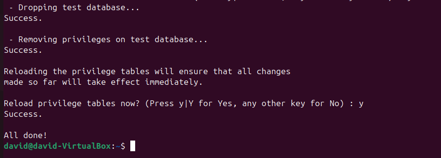

# LAMP

### Para empezar vamos a ejecutar los comandos 
````bash
sudo apt update
sudo apt install apache2 -y
````
### Para asegurarnos de que esta instalado, ejecutamos:
````bash
sudo systemctl status apache2
````


### Ahora instalamos mysql
````bash
sudo apt install mysql-server -y
````

### Para asegurarnos de que esta instalado, ejecutamos:

````bash
sudo mysql_secure_installation
````



### Nos conectamos a mysql con este comando

````bash
sudo mysql -u root -p
````

### Dentro de esta, creamos una base de datos, le añadimos una tabla, y un insert dentro de esta

````bash
CREATE DATABASE testdb;
USE testdb;

CREATE TABLE estudiantes (
    id INT AUTO_INCREMENT PRIMARY KEY,
    nombre VARCHAR(50),
    edad INT
);

INSERT INTO estudiantes (nombre, edad) VALUES ('Juan', 20), ('Maria', 22);

SELECT * FROM estudiantes;
````


### Instalamos la version mas reciente de php

````bash
sudo apt install php libapache2-mod-php php-mysql -y
````

### Creamos un fichero de prueba, dentro de sudo nano /var/www/html/info.ph pque tiene que tener el contenido siguiente:

````bash
<?php
phpinfo();
?>
````

### Abrimos el navegaor ponemos http://localhost/info.php y tiene que salir algo asi


### Creamos un usuario y le damos todos los permisos


### Despues dentro de /var/www/html/ creamos un fichero que se llame alumno.php, con el siguiente contenido

````bash
<?php
// Datos de la base de datos
$usuario = "*Tu usuario*";
$password = "*Tu contraseña*";
$servidor = "localhost";
$basededatos = "alumnos";

// Creación de la conexión a la base de datos
$conexion = mysqli_connect($servidor, $usuario, $password, $basededatos) or die("No se ha podido conectar al servidor de Base de datos");

// Consulta. Guardamos en variable.
$consulta = "SELECT * FROM estudiantes";
$resultado = mysqli_query($conexion, $consulta) or die("Algo ha ido mal en la consulta");

// Mostrar el resultado de los registros de la base de datos
echo "<table border='1'>";
echo "<tr><th>Nombre</th><th>Edad</th></tr>";

// Bucle while que recorre cada registro y muestra cada campo en la tabla.
while ($columna = mysqli_fetch_array($resultado)) {
    echo "<tr><td>" . $columna['nombre'] . "</td><td>" . $columna['edad'] . "</td></tr>";
}

echo "</table>"; // Fin de la tabla

// Cerrar conexión de base de datos
mysqli_close($conexion);
?>

````

### Después en el navegador ponemos http://localhost/alumnos.php y este seria el resultado:


### Instalamos phpmyadmin con el siguiente comando 

````bash
sudo apt install phpmyadmin -y
````

### Cuando nos salga lo siguiente, elegimos apache2


### Utilizamos estos comandos para habilitar php y reiniciar apache

````bash
sudo phpenmod mbstring
sudo systemctl restart apache2
````

### Accediendo a http://localhost/phpmyadmin nos tendria que salir esto


### Instalamos GoAccess con el siguiente comando

````bash
sudo apt install goaccess -y
````

### y vemos los logs de la siguiente manera:

````bash
sudo goaccess /var/log/apache2/access.log -c
````


