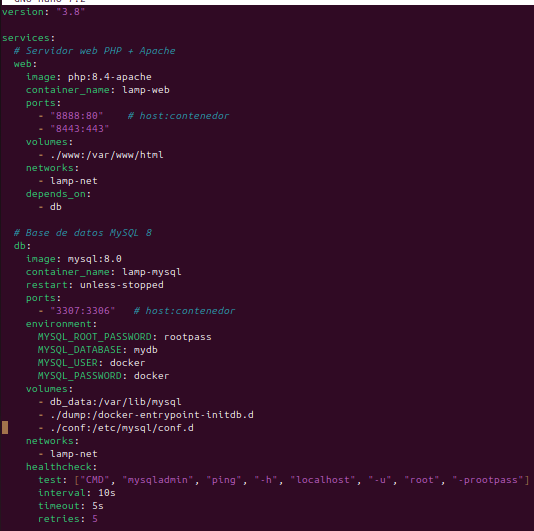
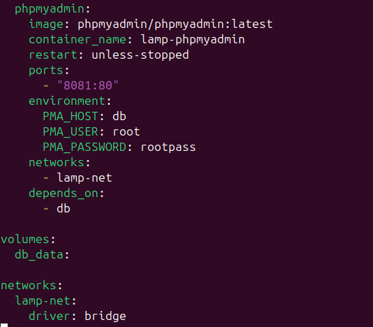
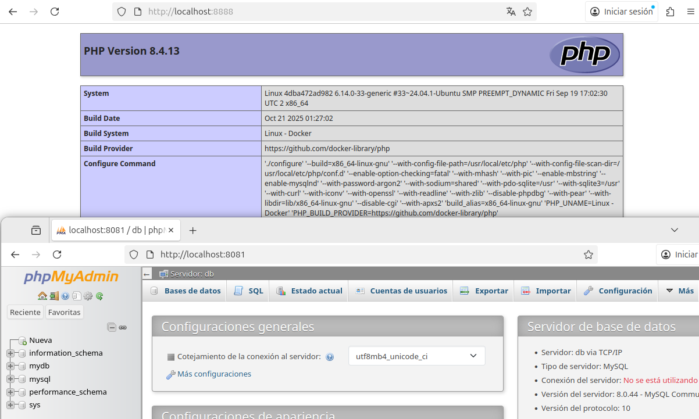

# LAMP CON DOCKER COMPOSE

### Creamos un docker compose

# WEB

### Con el image cogemos la imagen oficial de php con apache, con el container-name le ponemos nombre, despues estan los puestos a los que vamos a conectarnos el volumes monta la carpeta .www dentro del contenedor en /var/www/html le metemos en la network creada mas abajo y con depends_on garantiza que inicie el docker antes que db para que no hayan fallos

# DB

### Lo mismo de antes solamente que cambiamos el puerto de 3306 a 3307 por si lo tenemos ocupado, en enviaroment se configura el nombre contraseña y base de datos,en volumes lo mismo que con web, la unica diferencia es que esta el db_data que utilia el volumen de docker, y el healtcheck verifica si el mysql esta listo antes que los demas servicios se conecten

# PHPMYADMIN

### Lo mismo que los demas, pero cambiando variables con las necesarias

### Aqui comprobamos que todo funciona

### DAVID MORENO RODRIGUEZ

