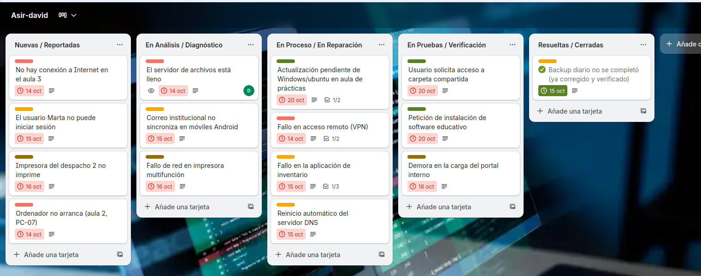
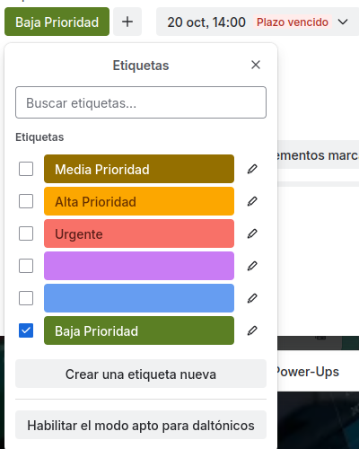
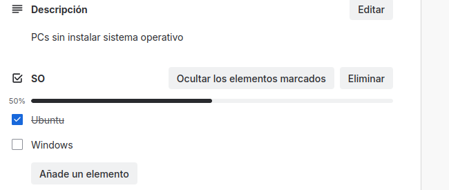
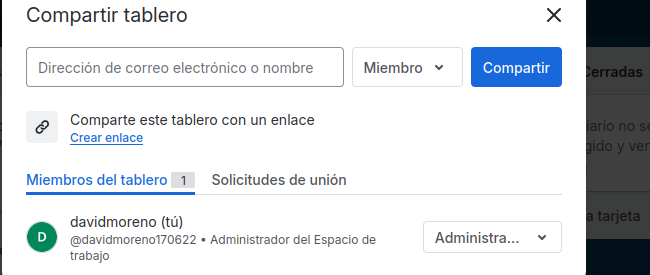

# TRELLO 

## He separado en 5 columnas las distintas etapas de las incidencias

## En cada una de ellas esta la tarea por realizar y los pasos dentro de esta, tanto como sus color de prioridad como su fecha de expiración

## Aqui vemos las diferentes prioridades separadas por sus colores, mas rojo, mas prioridad, mas verde menos prioridad, y tambien tenemos al lado la fecha de vencimiento, que es el objetivo el cual debemos mirar para tener lista la tarea en ese plazo

## Aqui tenemos el checkbox y la descripcion que es un poco la información que nos da sobre de lo que va o lo que tenemos que hacer en la tarea

## Tambien como vemos aqui podemos invitar a personas como pueden ser nuestros compañeros de clase o del trabajo 

## Tambien que se me a olvidado comentar en la primera o en todas las capturas hemos cambiado la foto del fondo para que sea del tema de lo que estamos trabajando

## Hay tres ventajas de digitalizar el proceso.

-*Eficiencia y ahorro de tiempo*

-*Acceso a información en tiempo real*

-*Reducción de costos y mayor sostenibilidad*

# DAVID MORENO RODRIGUEZ