# Docker

## Ejercicio 1: Servidor Nginx en modo demonio

### Aqui tenemos como ejecutamos el contenedor ed nginx en segundo plano y vemos como funciona a partir de la pagina de localhost por el puerto 8080
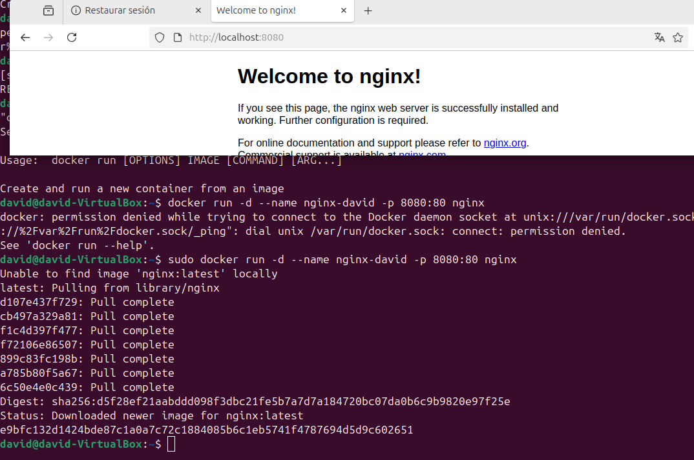

### y asi veriamos el log 

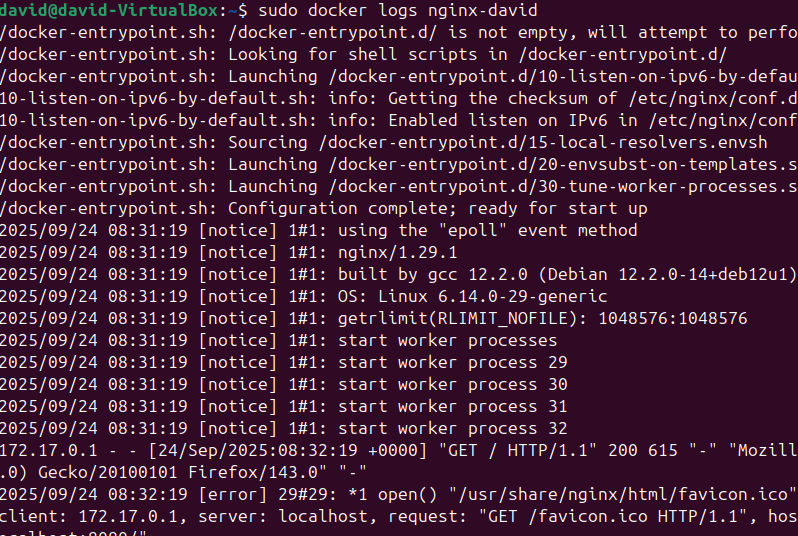

## Ejercicio 2: Uso de volúmenes en Nginx

### Creamos un directorio y dentro de este un fichero html simple

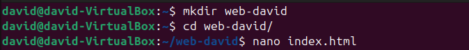

### Despues creamos un contenedor que coga de referencia nuestra pagina web, habra que cambiar el puerto ya que el 8080 esta utilizandose, a no ser de que li cerremos, si cambiamos el fichero podemos ver como entrando al localhost lo vemos modificado

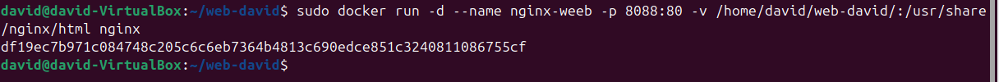

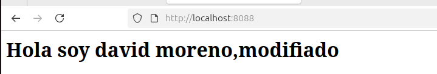

## Ejercicio 3: Construcción de una imagen con Dockerfile

### Creamos el docker file con este contenido

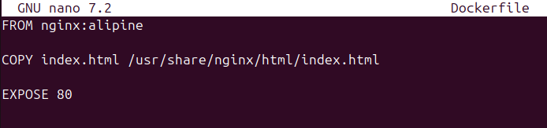

### Creamos la imagen de nginx y el fichero html correspondiente

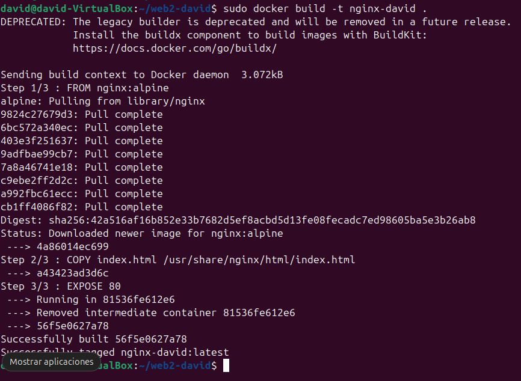

### Ahora hacemos que se ejecute en segundo plano y entramos en el local host del puerto que hemos indicado, y nos sale el contenido del fichero html correspondiente

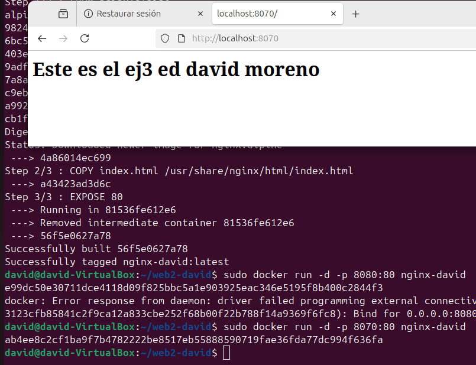

## Ejercicio 4: Orquestación básica con Docker Compose

### Creamos el archivo yml 

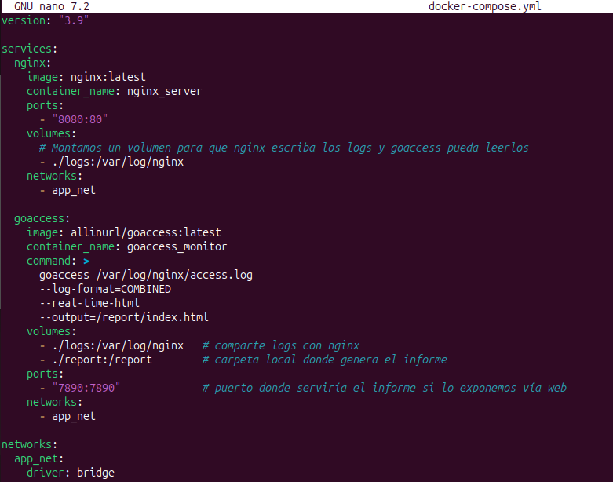

### Aqui comprobamos que funciona

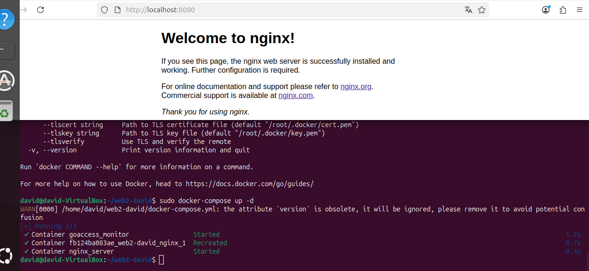

## Ejercicio 5: Despliegue de Nextcloud

### Activamos el contenedor de cloud con el puerto 8099

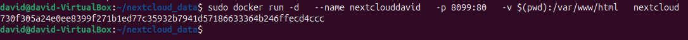

### Aqui comprobamos que funciona

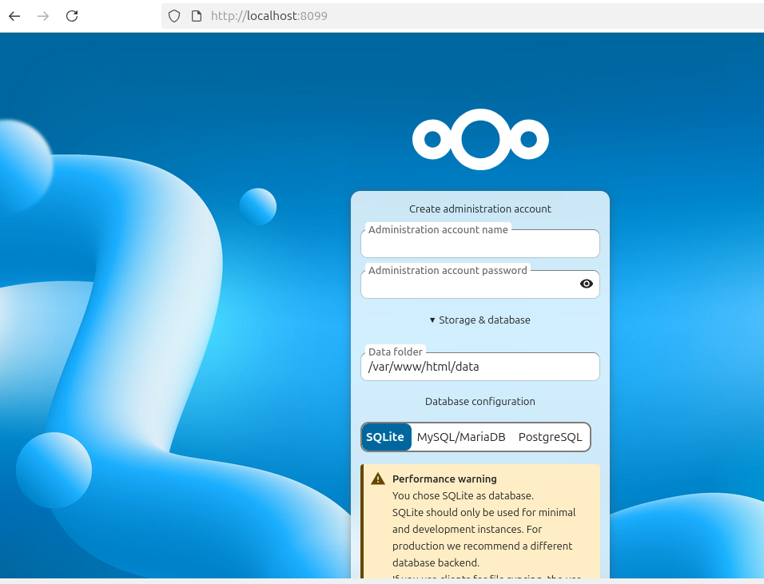

## DAVID MORENO RODRIGUEZ

