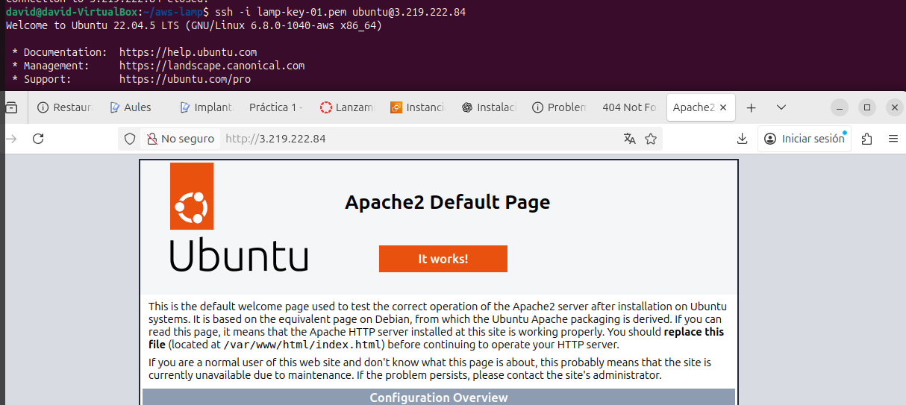

# LAMP-AWS

### Creamos la ec2 con este ejecutable

````bash
#!/bin/bash
set -e

# Configura tus credenciales AWS como variables de entorno en la sesión
# export AWS_ACCESS_KEY_ID="TU_ACCESS_KEY"
# export AWS_SECRET_ACCESS_KEY="TU_SECRET_KEY"
# export AWS_SESSION_TOKEN="TU_SESSION_TOKEN"
# export AWS_DEFAULT_REGION="us-east-1"

KEY_NAME="lamp-key-01"
SG_NAME="lamp-sg-01"

# Última AMI Ubuntu 22.04
AMI=$(aws ec2 describe-images --owners 099720109477 \
  --filters "Name=name,Values=ubuntu/images/hvm-ssd/ubuntu-jammy-22.04-amd64-server-*" \
  --query 'Images | sort_by(@, &CreationDate)[-1].ImageId' --output text)

# Crear par de claves
aws ec2 create-key-pair --key-name $KEY_NAME --query 'KeyMaterial' --output text > ${KEY_NAME}.pem
chmod 400 ${KEY_NAME}.pem

# Crear grupo de seguridad y abrir puertos
SG_ID=$(aws ec2 create-security-group \
  --group-name $SG_NAME \
  --description "LAMP SG" \
  --query 'GroupId' \
  --output text)

aws ec2 authorize-security-group-ingress --group-id $SG_ID --protocol tcp --port 22 --cidr 0.0.0.0/0
aws ec2 authorize-security-group-ingress --group-id $SG_ID --protocol tcp --port 80 --cidr 0.0.0.0/0
aws ec2 authorize-security-group-ingress --group-id $SG_ID --protocol tcp --port 443 --cidr 0.0.0.0/0

# Crear la instancia EC2
INSTANCE_ID=$(aws ec2 run-instances --image-id $AMI --count 1 --instance-type t2.micro \
  --key-name $KEY_NAME --security-group-ids $SG_ID \
  --query 'Instances[0].InstanceId' --output text)

aws ec2 wait instance-running --instance-ids $INSTANCE_ID

# Asignar IP elástica
ALLOC_ID=$(aws ec2 allocate-address --query 'AllocationId' --output text)
aws ec2 associate-address --instance-id $INSTANCE_ID --allocation-id $ALLOC_ID

# 7Mostrar la IP pública para acceder desde el navegador
EIP=$(aws ec2 describe-addresses --allocation-ids $ALLOC_ID --query 'Addresses[0].PublicIp' --output text)
echo "Tu instancia EC2 está lista. IP elástica: $EIP"

# 8Conexión SSH
echo "Conéctate así: ssh -i ${KEY_NAME}.pem ubuntu@$EIP"
````

### Ejecutamos esto y nos saldra este mensaje echo "Conéctate así: ssh -i ${KEY_NAME}.pem ubuntu@$EIP", $EIP es la ip elastica, a la cual nos conectaremos en el navegador.

### Ahora dentro de la maquina ejecutamos este .sh

````bash
#!/bin/bash
set -e

# =============================
# Script de instalación LAMP
# =============================

# Actualizar sistema
sudo apt update && sudo apt upgrade -y

# Instalar Apache, PHP y MySQL
sudo apt install apache2 mysql-server php libapache2-mod-php php-mysql -y

# Habilitar y arrancar servicios
sudo systemctl enable apache2
sudo systemctl start apache2
sudo systemctl enable mysql
sudo systemctl start mysql

# Crear página de prueba PHP
echo "<?php phpinfo(); ?>" | sudo tee /var/www/html/info.php > /dev/null

# Instalar phpMyAdmin
sudo apt install phpmyadmin php-mbstring php-zip php-gd php-json php-curl -y
sudo phpenmod mbstring
sudo systemctl restart apache2

# Instalar Adminer
sudo mkdir -p /var/www/html/adminer
sudo wget "https://www.adminer.org/latest.php" -O /var/www/html/adminer/index.php
sudo systemctl restart apache2

# Instalar GoAccess (analizador de logs)
sudo apt install goaccess -y
sudo mkdir -p /var/www/html/goaccess
sudo goaccess /var/log/apache2/access.log -o /var/www/html/goaccess/report.html --log-format=COMBINED

# Configurar acceso restringido con .htaccess
sudo mkdir -p /var/www/html/protegido
echo "AuthType Basic
AuthName \"Acceso restringido\"
AuthUserFile /etc/apache2/.htpasswd
Require valid-user" | sudo tee /var/www/html/protegido/.htaccess > /dev/null
sudo htpasswd -c /etc/apache2/.htpasswd usuario1
sudo systemctl restart apache2

# Instalar AWStats (actividad de ampliación)
sudo apt install awstats -y

# Configurar AWStats para Apache (ejemplo básico)
sudo cp /etc/awstats/awstats.conf /etc/awstats/awstats.local.conf
sudo sed -i "s/^LogFile=.*/LogFile=\"\/var\/log\/apache2\/access.log\"/" /etc/awstats/awstats.local.conf
sudo sed -i "s/^SiteDomain=.*/SiteDomain=\"localhost\"/" /etc/awstats/awstats.local.conf
sudo systemctl restart apache2

# Mensaje final
echo "==========================="
echo "Instalación LAMP completa!"
echo "Apache: http://<TU_IP>/"
echo "phpMyAdmin: http://<TU_IP>/phpmyadmin"
echo "Adminer: http://<TU_IP>/adminer"
echo "GoAccess: http://<TU_IP>/goaccess/report.html"
echo "Directorio protegido: http://<TU_IP>/protegido"
echo "AWStats: http://<TU_IP>/awstats/awstats.local.conf"
echo "==========================="
````

### Ahora lo probamos con el servidor apache y vemos que funciona con la ip elastica que nos da el aws



# DAVID MORENO RODRIGUEZ