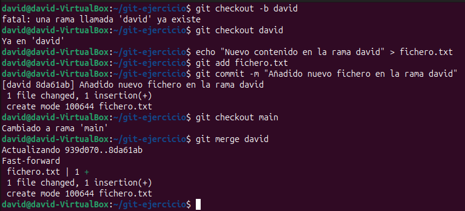
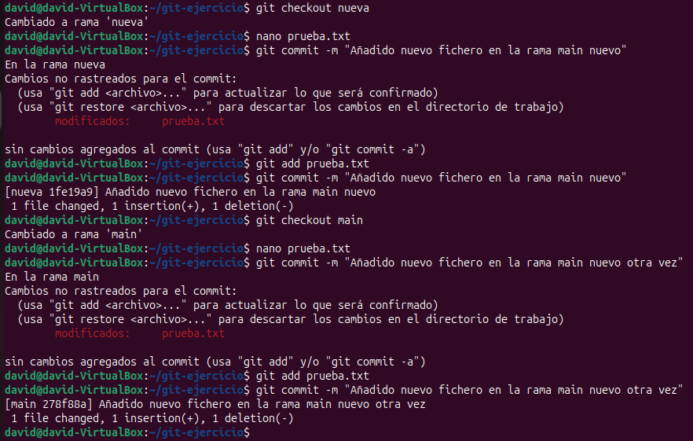
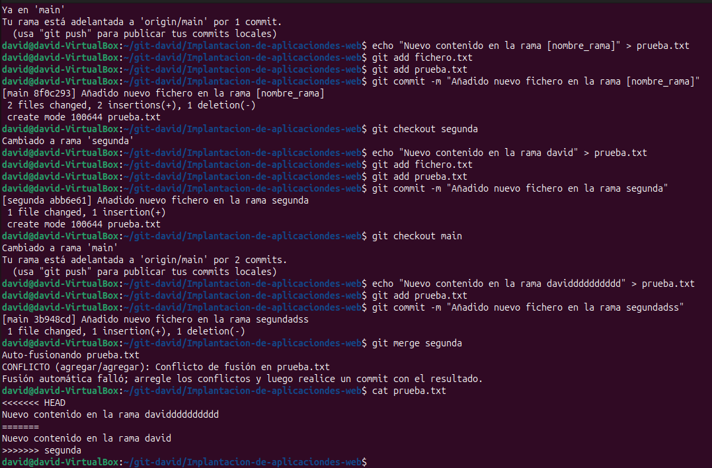
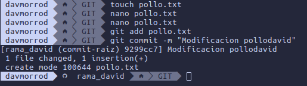
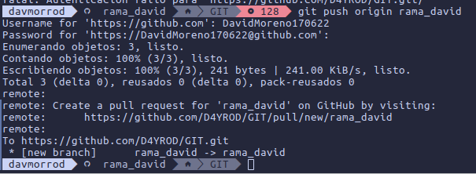
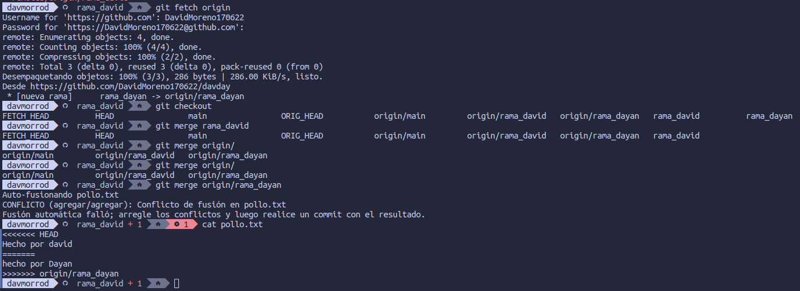
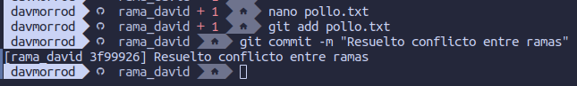

# Ramas 

### Aqui lo que hacemos es crear una rama directamente meternos en esta, modificar un fichero y actualizar la rama

### Aqui hacemos lo mismo pero con otro fichero, para despues fusionarlos

### Aqui modificamos otra vez uno de los ficheros y lo fusionamos con la rama *segunda*, y podemos ver que al guardar, dentro del fichero fusionado, sale que hemos cambiado y desde donde

### Ahora vamos a hacer lo mismo pero desde otro pc con un compañero en este caso Dayan, creamos un fichero, le ponemos un mensaje,  lo subimos al repositorio

### subimos la rama al github

### Ahora fusionamos el fichero, actualizamos la rama origin antes de fusionarla, y al mirar el fichero despues de la fusion vemos el estado en conflicto

### y en este ultima captura vemos como hay un +1 al lado del nombre de la rama, que son los conflictos que hay activos, lo solucionamos y al hacer el commit vemos como se han resuelto el conflicto y ya no nos sale el +1 de antes

## DAVID MORENO RODRIGUEZ